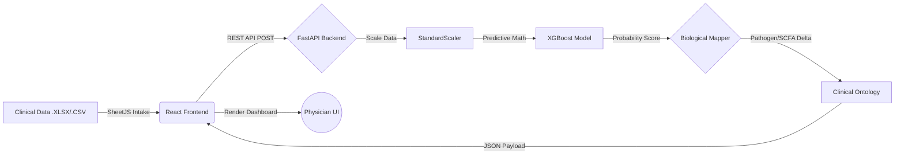

<div align="center">

# 🧬 Precision Nutrition AI 
**Clinical-Grade Multi-Omics & Microbiome Reasoning Engine**

[](https://python.org)
[](https://fastapi.tiangolo.com)
[](https://reactjs.org/)
[](https://xgboost.ai/)
[](#)

*A decoupled microservices platform bridging Machine Learning classification with Biological Ontology to deliver personalized, prescriptive dietetics.*

</div>

---

## 📖 Table of Contents
- [Executive Summary](#-executive-summary)
- [System Architecture](#%EF%B8%8F-system-architecture)
- [Clinical Capabilities](#-clinical-capabilities)
- [The Biological Ontology Engine](#-the-biological-ontology-engine)
- [Technology Stack](#-technology-stack)
- [Directory Structure](#-directory-structure)
- [Local Installation & Quick Start](#-local-installation--quick-start)
- [Author](#-author)

---

## 🔬 Executive Summary
 - Standard nutritional AI often limits itself to binary classification (e.g., "Healthy" vs. "Unhealthy"). **Precision Nutrition AI** transcends this by functioning as a digital clinical dietician. 

- The platform ingests high-dimensional multi-omics datasets (metagenomics, metabolomics, and host phenotypes), computes a Dysbiosis Risk Factor via an XGBoost ML algorithm, and maps the patient's specific metabolic deficiencies to a robust **Clinical Rules Ontology**. The output is a highly personalized, dynamically generated nutritional intervention designed to restore metabolic homeostasis.

---

## ⚙️ System Architecture

The platform utilizes a modern decoupled architecture, ensuring scalability, security, and distinct separation of concerns between the mathematical engine and the clinical presentation layer.


## 🩺 Clinical Capabilities
- Dynamic Patient Intake: Native ingestion of .xlsx and .csv cohort data, instantly parsing cross-sheet clinical records.

- Disease-Contextual Branching: The AI adjusts dietary prescriptions based on the patient's baseline diet (Plant vs. Animal dominant) and exact clinical history (e.g., IBD, Type 2 Diabetes).

- Targeted Metabolite Tracking: Monitors keystone taxa (Akkermansia, Faecalibacterium) and sentinel metabolites (Butyrate, Acetate, Inflammation markers).

- Mathematical Deltas: Computes the exact numerical deficit of biological markers and explicitly targets the gap in the clinical rationale.

---

## 🧠 The Biological Ontology Engine
The backend biological_mapper.py operates on functional medicine principles, evaluating mechanistic pathways rather than raw data points:

- Barrier Integrity: Detects SCFA (Butyrate) deficiencies. Prescribes clinical-grade resistant starches and inulin-rich fibers to repair epithelial tight junctions.

- Mucosal Optimization: Maps Akkermansia degradation to insulin resistance risks, triggering high-dose polyphenol and Omega-3 interventions.

- Endotoxemia Starvation: Identifies bile-tolerant opportunistic pathogens (Bilophila) and restricts specific saturated animal fats or artificial emulsifiers to lower systemic inflammation.

---

## 💻 Technology Stack
Machine Learning & Backend (Python)
- Core API: FastAPI / Uvicorn

- ML Algorithms: XGBoost (Gradient Boosting Decision Trees)

- Data Processing: Pandas, Scikit-Learn (StandardScaler)

- Model Serialization: Joblib

Frontend & Visual Analytics (JavaScript)
- Framework: React.js (Vite)

- Styling: TailwindCSS

- Data Visualization: Recharts

- Clinical Data Parser: SheetJS (xlsx)

- Icons: Lucide-React

---

## 📂 Directory Structure

```text
precision-nutrition-ai/
|
├── api/                             # Python ML Backend
|   ├── main.py                      # FastAPI Server & Data Validation
|   ├── biological_mapper.py         # Clinical Rules Ontology Engine
|   ├── requirements.txt             # Python Dependencies
|   └── models/                      
|       ├── xgboost_model.pkl        # Trained Dysbiosis Classifier
|       └── standard_scaler.pkl      # Feature Normalization Matrix
|
└── client/                          # React Frontend Portal
    ├── src/
    |   ├── App.jsx                  # Main Clinical Dashboard UI
    |   ├── index.css                # Tailwind Directives
    |   └── main.jsx                 # React Entry Point
    ├── package.json                 # Node Dependencies
    ├── tailwind.config.js           # UI Theme Configuration
    └── vite.config.js               # Build Tooling
```
---

## 🚀 Local Installation & Quick Start
1.Initialize the AI Engine (Backend)
Navigate to the API directory, install dependencies, and boot the FastAPI server.
```text
Bash
cd api
pip install -r requirements.txt
uvicorn main:app --reload
```
The engine will load the .pkl models into memory and expose http://localhost:8000/analyze.

2.Initialize the Clinical Portal (Frontend)
Open a separate terminal instance, install Node dependencies, and start the Vite development server.
```text
Bash
cd client
npm install
npm run dev
```
3.Run a Clinical Simulation
Open the local application in your browser (typically http://localhost:5173).

- Upload the Clinical_Cohort_Mapped_Data.xlsx file via the Data Intake module.

- Select any de-identified patient record from the dropdown.

- Click Run AI to generate a bespoke, dynamically reasoned clinical nutrition report.
